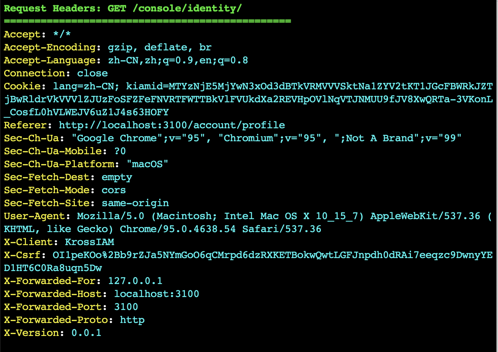

:::tip 提示
本文的内容只有开发时才能看到，正式版本不会包含这些内容。
:::

## 说明

在开发时（编译时指定了 `dev` tag），默认会以彩色输出日志信息，例如下面截图：

<!--truncate-->

这比单色的输出看起来清晰一点，方便开发人员快速获取信息，但是有一些局限。

## 颜色不能自定义

系统在代码中直接写入了使用的颜色，这些颜色没法配置（除非修改代码），所以，
对于使用不同背景颜色的终端，看起来不太一样。
系统设计时选择的颜色是基于黑色（暗色）背景的终端。如果在白色（亮色）背景的终端上，
看起来颜色非常的浅（费劲）。

## 禁用颜色

可以通过设置环境变量 `NO_COLOR=true` 来禁止使用颜色。

## 调整颜色

可以修改 `dump.go` 文件代码来调整颜色，这个文件使用 `github.com/fatih/color` 模块。
dump.go 输出 4 个信息：HTTP 请求头/请求体、响应头/响应体。
