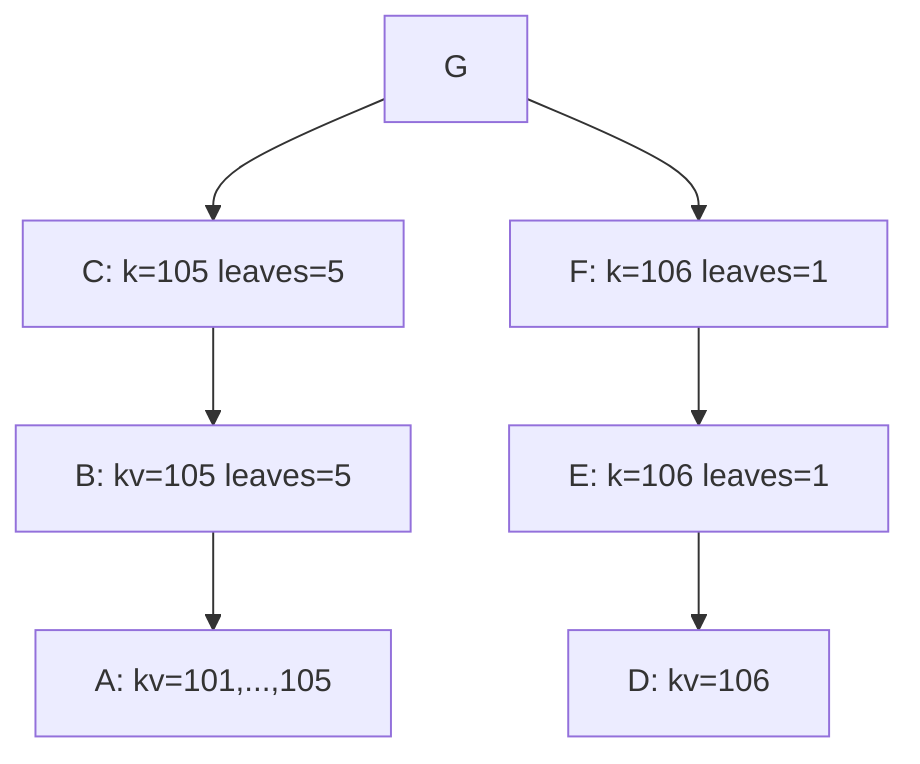
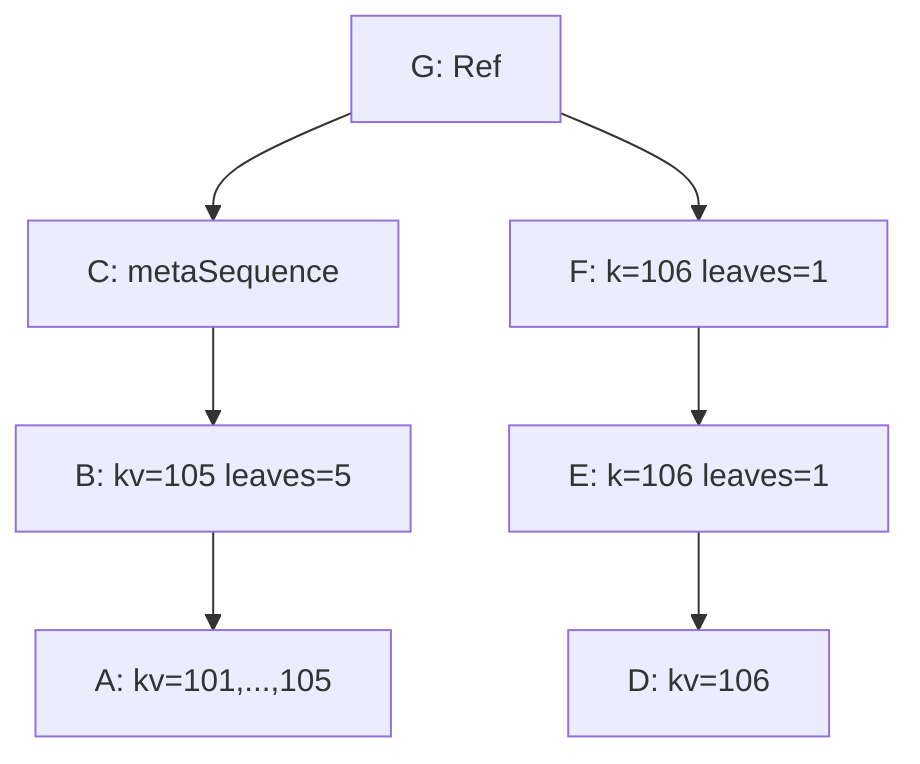

# noms part-2

- 阅读 [noms-pre-release](https://github.com/kalman/noms-pre-release) 代码

复杂类型Value 涉及到 Merkle DAG, 先从 `newRollingValueHasher` 和 `sequence` , `List` 开始

## encode Value

> - 库函数 `binary.PutVarint()` 可以将int写入[]byte, 写入的字节数是可变的，依赖于值的大小，比如 12 写1字节，300 写2字节.
- 如何写入 `101` 呢?
  - x=101=b1100101, 先 x << 1 (*去掉int的符号，变成uint64*) 
  - 得到 y = `'b1100101'0` (202)
  - 如果x为负数, 将上面的y取反
- 再`PutUvarint`, 其算法为: 从高往低，每次写8个比特，但只移动`>>7`个比特
  - 因为 y 有8个比特，故写入2次，第一次写入 `'b1100101'0` = 202, 移动后得到 `b1'1001010' = b1` = 1, 第二次写入 `b1
- 故 101 吸入[]byte = [202 1]

### Number

```go
num101 := types.Number(101)
[1 202 1 0]
```

```
[1           202 1           0 ]
[NumberKind, Number整数部分,  Number-exp部分]
```

### String

```go
name101 := types.String("name-101")
[2 0 0 0 8 110 97 109 101 45 49 48 49]
```

```
[2           0 0 0 8   110 97 109 101 45 49 48 49]
[StringKind, 长度,      字符串name-101]
```

### Map

```go
map101 := types.NewMap(num101, name101)
[6 1 2 0 0 0 0 1 1 202 1 0 2 0 0 0 8 110 97 109 101 45 49 48 49]
```
```
[6 1 2                          0             
0 0 0 1         1 202 1 0       2 0 0 0 8 110 97 109 101 45 49 48 49]
[MapKind<NumberKind,StringKind> metaSequence? 
mapLeafSequence:
len(map)        key(101)        value(name-101)
]
```

### Ref

```go
num101 := types.Number(101)
ref101 := types.NewRef(num101)
```
```
num101.hash= 55nap1ej6bf5apgja8dt9gh76i2crlqe [41 110 172 133 211 50 222 85 102 19 82 27 212 194 39 52 132 205 215 78]
ref101.hash= cbsb7f47ofgt52ufgg4c4m51orjtbuhm [98 248 179 188 135 195 225 210 139 207 132 8 194 88 161 198 231 213 250 54]
put: 4 55nap1ej6bf5apgja8dt9gh76i2crlqe [1 202 1 0]
put: 30 cbsb7f47ofgt52ufgg4c4m51orjtbuhm [7 1 41 110 172 133 211 50 222 85 102 19 82 27 212 194 39 52 132 205 215 78 0 0 0 0 0 0 0 1]
put: 30 cbsb7f47ofgt52ufgg4c4m51orjtbuhm 
[7 1 Ref<Number>
41 110 172 133 211 50 222 85 102 19 82 27 212 194 39 52 132 205 215 78 num101.hash Ref.TargetHash
0 0 0 0 0 0 0 1   uint64 Ref.Height
]
```

## Prolly Tree 结构

- metaSequence，即internal-node
- metaTuple 即node，leaf or internal-node

### metaTuple

```go
// metaTuple is a node in a Prolly Tree, 
// consisting of data in the node (either tree leaves or other metaSequences), 
// and a Value annotation for exploring the tree (e.g. the largest item if this an ordered sequence).
type metaTuple struct {
  ref       Ref         // 指向child-Value
  key       orderedKey  // 节点key
  numLeaves uint64      // leaf数目
  child     Collection  // 子节点们, may be nil
}

```

### Map rolling block=4096

数据6条: num101-num106

- put: 110 60og6a3a2sc4rlh8sblur8asrkditfgd 

```
[6 1 2    Map<Number,String>
0 meta?
0 0 0 6 Len=6 
1 202 1 0 2 0 0 0 8 110 97 109 101 45 49 48 49 kv=101
1 204 1 0 2 0 0 0 8 110 97 109 101 45 49 48 50 
1 206 1 0 2 0 0 0 8 110 97 109 101 45 49 48 51 
1 208 1 0 2 0 0 0 8 110 97 109 101 45 49 48 52 
1 210 1 0 2 0 0 0 8 110 97 109 101 45 49 48 53 
1 212 1 0 2 0 0 0 8 110 97 109 101 45 49 48 54 kv=106
]
```

### block = 128
- root= `G` 9398tol3nh82ad2arlmh62pvttjsfm2q
- put: `A` 93 hrh071sa9hlb2vftart65bjqlot2h1nv 
  `[142 226 3 135 138 76 106 177 125 253 86 250 98 174 122 174 58 40 134 255]`
```
[6 1 2 0 meta=false
0 0 0 5 
1 202 1 0 2 0 0 0 8 110 97 109 101 45 49 48 49 
1 204 1 0 2 0 0 0 8 110 97 109 101 45 49 48 50 
1 206 1 0 2 0 0 0 8 110 97 109 101 45 49 48 51 
1 208 1 0 2 0 0 0 8 110 97 109 101 45 49 48 52 
1 210 1 0 2 0 0 0 8 110 97 109 101 45 49 48 53 kv=105
]
```
- put: `B` 52 fs5net9l4q3a7fbee0anp0ir6sglg418 
  `[127 11 119 117 53 38 134 163 189 110 112 21 124 130 91 55 33 88 16 40]`
```
[6 1 2 1    meta=true
0 0 0 1     len(seq) 
7 6 1 2     Ref<Map<Number, String>> 
142 226 3 135 138 76 106 177 125 253 86 250 98 174 122 174 58 40 134 255  BlockA
0 0 0 0 0 0 0 1   height=1 
1 210 1 0         key=105
0 0 0 0 0 0 0 5   numLeaves=5
]
```

- put: `C` 52 8sppjnnkptrdc5h4e8p9tckbhlt92gqv 
  `[71 51 153 222 244 207 118 214 22 36 114 50 158 178 139 141 122 145 67 95]`
```
[6 1 2 1  meta=true
0 0 0 1   len(seq) 
7 6 1 2   Ref-type-desc
127 11 119 117 53 38 134 163 189 110 112 21 124 130 91 55 33 88 16 40   BlockB
0 0 0 0 0 0 0 2   height=2
1 210 1 0         key=105
0 0 0 0 0 0 0 5   numLeaves=5
]
```
- put: `D` 25 lbdrsk6okvmd280k4s7gshqecdn8cmg6 
  `[170 219 190 80 216 167 236 209 32 20 39 15 14 71 78 99 110 134 90 6]`
```
[6 1 2 0  meta=false
0 0 0 1   len=1 
1 212 1 0 2 0 0 0 8 110 97 109 101 45 49 48 54    kv=106
]
```
- put: `E` 52 p59cgoju726n7ed3d8e2o6kgm4h4i0t2 
  `[201 82 200 98 126 56 141 115 185 163 106 28 44 26 144 177 34 73 3 162]`
```
[6 1 2 1  meta=true 
0 0 0 1   len(seq) 
7 6 1 2   type
170 219 190 80 216 167 236 209 32 20 39 15 14 71 78 99 110 134 90 6   BlockD 
0 0 0 0 0 0 0 1  height=1
1 212 1 0        key=106
0 0 0 0 0 0 0 1  numLeaves=1
]
```
- put: `F` 52 k0i3o104sftjb16cm0ibur6ps4iqubhf 
  `[160 36 60 4 4 227 251 53 132 204 176 36 191 108 217 225 37 175 46 47]`
```
[6 1 2 1 meta=true 
0 0 0 1 seq-len 
7 6 1 2 type 
201 82 200 98 126 56 141 115 185 163 106 28 44 26 144 177 34 73 3 162  BlockE
0 0 0 0 0 0 0 2   height=2 
1 212 1 0         key=106 
0 0 0 0 0 0 0 1   numLeaves=1
]
```
- put: `G` 96 9398tol3nh82ad2arlmh62pvttjsfm2q 
  `[72 210 142 226 163 188 80 37 52 74 221 109 19 11 63 239 103 199 216 90]`
```
[6 1 2 1  meta=true 
0 0 0 2   seq-len=2
7 6 1 2   第一条
71 51 153 222 244 207 118 214 22 36 114 50 158 178 139 141 122 145 67 95  ->BlockC
0 0 0 0 0 0 0 3 height=3 
1 210 1 0       key=105
0 0 0 0 0 0 0 5 numLeaves=5 
7 6 1 2   第二条
160 36 60 4 4 227 251 53 132 204 176 36 191 108 217 225 37 175 46 47  -> BlockF
0 0 0 0 0 0 0 3 height=3
1 212 1 0       key=106
0 0 0 0 0 0 0 1 numLeaves=1
]
```

### rolling hash

在 byte-stream rolling过程中，先检测 pattern, 当检测到后，**不能立即分割**，必须等到 Value encoded byte-stream 写完之后!

### 画成图

#### Chunk图



#### Type
- 类型，节点， TODO：结构图



### Map 编辑


## sequence 接口

```go
type sequenceItem interface{} // array-object
type compareFn func(x int, y int) bool // array内部item比较

type sequence interface {
  getItem(idx int) sequenceItem
  seqLen() int  // 数组操作

  numLeaves() uint64 // ???

  valueReader() ValueReader // ValueReader操作对象

  Chunks() []Ref
  Type() *Type  // Value 接口

  getCompareFn(other sequence) compareFn
}
```

## indexedSequence 接口

```go
type indexedSequence interface {
  sequence
  // returns the total number of leaf values reachable 
  // from this sequence for all sub-trees from 0 to |idx|
  cumulativeNumberOfLeaves(idx int) uint64 
}
```
## List

```
type List struct {
  seq indexedSequence
  h   *hash.Hash
}
```


