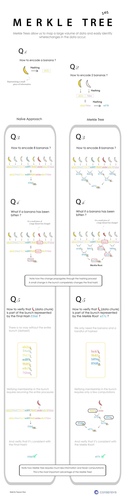

# Merkle-Tree

## Hashcode

简单说，存在2种hash：
- 不会冲突的Hash: 例如MD5,SHA1之类的；
- 另一种会冲突: 例如java对象的hashcode，或简单取模。

这两种都有其特别的用处。

这里主要介绍 Merkle-Tree 和 Rolling-Hash 分别是2者的代表。

## 不冲突的Hash

哈希（Hash）和哈希树（Merkletree）

- Hash 摘要: 完整性校验
- Hash List: P2P 文件传输时，大文件分片，分片验证. (否则, 一次性废弃的数据过多重传，浪费时间)
  - 种子文件，就是分片数据的 Hash-List
  - 根Hash校验种子文件(根Hash: 对种子文件(Hash-List)做Hash, 得到 根Hash)
  - 根Hash必须时可信的。
- Hash Tree 有点:
  - 比 Hash-List 稍微复杂了一点点
  - Merkle Tree 好处是可以单独拿出一个分支来（作为一个小树）对部分数据进行校验
  - 比 Hash-List, 灵活和高性能

## Merkle-Tree

HashTree 优点很明显：
例如，寻找1024个快的大文件，找出那个block有区别：Hash-List 需要比较 1024 次，而Hash-Tree只需要$log_2(1024)$ = 10次

下图非常明了的解释了Merkle-Tree 的特点。 [图示来源](https://media.consensys.net/ever-wonder-how-merkle-trees-work-c2f8b7100ed3)

