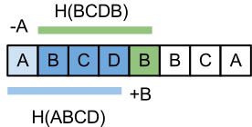

# Rolling-Hash

- https://zhuanlan.zhihu.com/p/67368838
- https://people.csail.mit.edu/alinush/6.006-spring-2014/rec06-rabin-karp-spring2011.pdf

翻译: [Rolling hash, Rabin Karp, palindromes, rsync and others](https://www.infoarena.ro/blog/rolling-hash)


**Rolling hash** is a neat idea found in the Rabin-Karp string matching algorithm 
which is easy to grasp and useful in quite a few different contexts.

As before, the most interesting part of the article is the problem section. 
Discuss them in the comment section, but first let's go through a few applications.

## The Rabin-Karp algorithm

Given a string `P` of length `n` and a string `S` of length `m` find out all the occurrences of `P` within `S`

> 在 `S` 中, 找到每一个 `P` 的出现位置

The algorithm works by building a fingerprint for each substring of `S` of length `n`. 
It checks if any of them match the fingerprint of `P`. 
Implementing this directly leads to a $O(n \cdot m)$ solution 
which isn't faster than the naive matching algorithm (in fact it may be slower).

> KR算法是这样运作的: 在 `S` 中，将所有长度为 `n` 的 substring 做摘要；然后跟 `P` 的做比对。
> 如果不用一点***技巧***，该算法会很差。

**The insight** is that you can efficiently compute the hash value of a substring 
using the hash value of previous substring if you use the right hash function. 
A polynomial with the string characters as coefficients works well. 
Let $H(c)=c[0]a^{n-1} + c[1]a^{n-2}+...+c[n-1]$ be the hash function for the string `c`.
All the operations are done modulo a prime number so that we don’t have to deal with large integers.

> **该技巧**在于选一个合适的hash函数, 即: $H(c)=c[0]a^{n-1} + c[1]a^{n-2}+...+c[n-1]$ , 
> 最后，按一个质数, 对 `多项式` 取模。


Let’s see what happens when we go from $H(S[i..i+n-1])$ to $H(S[i+1..i+n])$ :




$$
\begin{align}
H(S[0..n-1])&= S[0]a^{n-1}+S[1]a^{n-2}+S[2]a^{n-3}+.. + S[n-1] \\ 
H(S[1..n])&= S[1]a^{n-1}+S[2]a^{n-2}+.. + S[n-1]a^1 + S[n] \\ 
aH(S[0..n-1])&= S[0]a^{n}+S[1]a^{n-1}+S[2]a^{n-2}+.. + S[n-1]a^1 \\ 
H(S[1..n]) - aH(S[0..n-1]) &= S[n] - S[0]a^{n} \\
H(S[1..n]) &= aH(S[0..n-1]) + S[n] - S[0]a^{n} \\
\end{align}
$$

一般地

$$
\begin{align}
H(S[i..i+n-1])&= S[i]a^{n-1}+S[i+1]a^{n-2}+S[i+2]a^{n-3}+.. + S[i+n-1] \\ 
H(S[i+1..+i+n])&= S[i+1]a^{n-1}+S[i+2]a^{n-2}+.. + S[i+n-1]a^1 + S[i+n] \\ 
aH(S[i..i+n-1])&= S[i]a^{n}+S[i+1]a^{n-1}+S[i+2]a^{n-2}+.. + S[i+n-1]a^1 \\ 
(7) - (8) &= S[i+n] - S[i]a^{n} \\
H(S[i+1..n]) &= aH(S[i..i+n-1]) + S[i+n] - S[i]a^{n} 
\end{align}
$$

Deleting a character and appending another one corresponds to adding a number and subtracting a number in our hashing algorithm. The complexity of the algorithm is O(n).

> 例如上面的图示，带入公式，即: $H(BCDB) = aH(ABCD) - \Alpha \cdot a^n + \Beta$
> 即每次移动一位，计算按上述公式计算HASH值，只需计算一次。


If `S` and `P` are strings of digits and `a` is `10`, 
our problem maps to finding numbers in a string of digits. 

Let's go through an example.

```
Let P = 53424, S = 3249753424234837 and a = 10
3249753424234837
32497      = 32497
 24975     = 10 * 32497 - 3 * 10000 + 5  
  49753    = 10 * 24975 - 2 * 10000 + 3
   97534   = 10 * 49753 - 4 * 10000 + 4 
     ...
     53424 // match
      ...
```

> 在上例中，
> * naive方法: 如果用strcmp比较, 每次都要比较 n 次(P的字符串长度), 要移动m次(S的长度), 所以复杂度 $O(n\cdot m)$
> * rolling-hash方法: 由于计算了hash值，strcmp的n次没有了，变成了hash计算，再比较hash值。故复杂度 $O(m)$
>
> 简单的说， strcmp 变成了比较 hash, 由于rolling-hash的优化，hash计算再比较的时间是定值。
> 对 n 特别大的strcmp，hash优化效果尤其明显！

Here's some code:

```py
an = 1
  rolling_hash = 0
  for i in range(0, n):
    rolling_hash = (rolling_hash * a + S[i]) % MOD
    an = (an * a) % MOD
  if rolling_hash == hash_p:
    print "match"
  for i in range(1, m - n + 1):
    rolling_hash = (rolling_hash * a + S[i + n - 1] - an * S[i - 1]) % MOD
    if rolling_hash == hash_p:
        print "match"
```
## Content Defined Chunking

> 固定分块的缺陷

固定分块将数据流按固定的长度分块，实现很简单，但某一处数据的变化将导致之后的所有分块都发生变化.
(比如定长64的块，第一块变成了 63 字节, 后面所有的块，都的变。)

**Content Defined Chunking** (`CDC`) 基于内容的变长分块, 能解决这一问题。

CDC数据块的长度, 在一个规定的最小值和最大值之间。
可变长度的数据块用一个滑动窗口来划分, 当滑动窗口的 hash 值与一个基准值相匹配时就创建一个分块,
这样数据块的尺寸就可达到一个期望的分布。

**Rabin’s fingerprint** 预先定义两个整数 `D` 和 `r` 。
假如在位置 `k`, 固定窗口内数据的 hash 值为 `f`。
如果 $f mod D = r$, 则该位置为数据块的一个边界。
重复这个过程,直至整个文件都被分块。


## Longest common substring

Given two strings `A` and `B`, compute their longest common substring.

Let's solve a simpler problem: Given two strings `A` and `B`, 
and a number `X` find if they have a common sequence of length `X`. 
We use the rolling hash technique to find the hash codes 
for all `X` length substrings of `A` and `B`. 
Then we check if there is any common hash code between the two sets, 
this means `A` and `B` share a sequence of length `X`. 
We then use binary search to find the largest `X`.
The complexity of this algorithm is $O(nlog_n)$.

## rsync
The linux utility is used to keep two copies of the same file in sync by copying around deltas.
Instead of replicating the whole changed file, rsync segments the file into fixed size chunks, 
computes a rolling hash for each chunk. On the client side computes rolling hashes 
for all chunks of the target file including overlapping ones. 
Then it checks which chunks are already there, 
which chunks need to be deleted and which chunks need to be copied over. 
This improves the transfer speed as you only copy over deltas and some chunk fingerprints. 
Here's a [better description](https://en.wikipedia.org/wiki/Rsync#Algorithm) from wikipedia.


## Caveats

**Hashing collisions** are a problem. 
One way to deal with them is to check for a match when two fingerprints are equal, 
but this makes the solution inefficient if there are lots of matches. 
Another way is to use more hashing functions to decrease the collision probability.

## Cyclic polynomial

- Jonathan D. Cohen, Recursive Hashing Functions for n-Grams, ACM Trans. Inf
- code: https://github.com/silvasur/buzhash

Hashing by **cyclic polynomial** — sometimes called **Buzhash**—
该算法细节有点烧脑，不去追究。简单说，就是RK类似，但是避免了乘法运算(效率更好)。

将上面RK算法的实例，用buzhash写一遍就是:

```
P= 53424    hash= 4010519111
S= 3249753424234837
32497       hash= 4159676869
 24975      hash= 227770241
  49753     hash= 1151390392
   97534    hash= 590652089
    75342   hash= 2377034338
     53424  hash= 4010519111 found
```

golang code:

```go
func TestBuzHash0(t *testing.T) {
	s := "3249753424234837"
	p := "53424"
	n := 5

	phash := buzhash.NewBuzHash(uint32(n))
	phash.Write([]byte(p))
	fmt.Println("P=", p, "\thash =", phash.Sum32())

	shash := buzhash.NewBuzHash(uint32(n))
	fmt.Println("S=", s)
	for i := 0; i <= len(s)-n; i++ {
		if i == 0 {
			shash.Write([]byte(s[:n]))
		} else {
			shash.HashByte(s[n+i-1])
		}
		sp := strings.Repeat(" ", i)
		fmt.Println(sp + s[i:i+n], "\thash=", shash.Sum32())
		if shash.Sum32() == phash.Sum32() {
			fmt.Println("found")
			break
		}
	}
}
```
