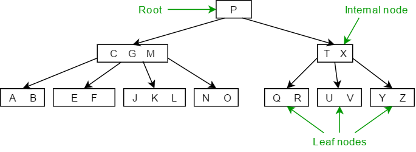
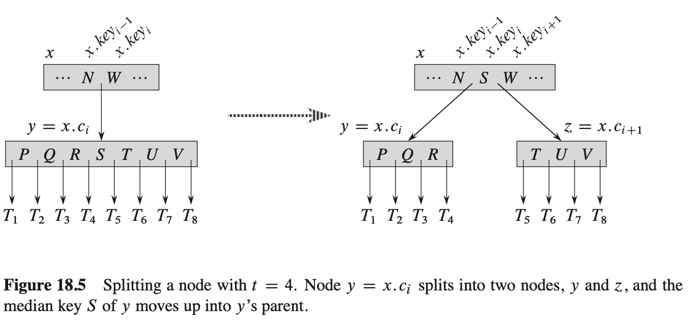

# B-Tree

- 动画: https://www.cs.usfca.edu/~galles/visualization/BTree.html
- https://vijini.medium.com/all-you-need-to-know-about-deleting-keys-from-b-trees-9090f3334b5c
- PDF: [Introduction to Algorithms](https://book.douban.com/subject/1433399/)
- 代码示例: https://github.com/amit-davidson/btree

## B-Tree 结构

***B-tree*** is a self-balancing search tree (the tree adjusts itself so that all the leaves are at the same depth) and contains multiple nodes which keep data in sorted order. Each node has 2 or more children and consists of multiple keys.

Following are the 5 properties of a ***B-tree***.
1. Every node `x` has the following:
   * `x.n` the number of keys currently stored in node `x`,
   * `x.key_i` (The keys stored in ascending order)
   * `x.leaf` (Whether x is a leaf or not)
2. Every internal node `x` has (`x.n + 1`) children.
3. The keys `x.key_i` separate the ranges of keys stored in each sub-tree.
4. All the leaves have the same depth, which is the tree **height** `h`.
5. Nodes have lower and upper bounds on the number of keys that can be stored. 
   Here we consider a value `t>=2`, called ***minimum degree*** 
   (or ***branching factor***) of the B tree.
   * If the tree is nonempty, the root must have at least one key.
   * Every internal node *(other than the root)* must have at least `(t - 1)` keys. 
     and at most `(2t - 1)` keys. 
     Hence, every internal node will have at least `t` children and at most `2t` children. 
   * We say the node is **full** if it has `(2t-1)` keys.

> 当 `t=2`时，得到最简 **B-tree** . 
> Every internal node then has either 2, 3, or 4 children, and we have a ***2-3-4 tree***. 
> 事实上，`t` 越大，则 B-tree 的 `h` 越小.

Figure: B Tree with root, internal nodes and leaf nodes

## Insertion

> 在 **BST** 中， we search for the leaf position at which to insert the new key. 
在 **AVL Tree** 中，比 **BST** 还要多一步，*rebalance* (重新平衡)。
在 **B-tree** 中，基本跟 **AVL Tree** 类似: 先插入，再平衡。

Instead, we insert the new key into an existing leaf node. 
Since we cannot insert a key into a leaf node that is **full**, 
we introduce an operation that **splits** a full node `y` (having `2t -1` keys) 
around its **median key** `y.key` into two nodes having only `t - 1` keys each. 
The median key moves up into `y`’s parent to identify the dividing point between the two new trees.
But if `y`’s parent is also **full**, we must **split** it before we can insert the new key, 
and thus we could end up splitting **full** nodes all the way up the tree.

As with a binary search tree, we can insert a key into a B-tree in a single pass down the tree 
from the root to a leaf. To do so, we do not wait to find out whether we will actually need 
to split a full node in order to do the insertion. Instead, as we travel down the tree searching 
for the position where the new key belongs, we split each full node we come to along the way 
(including the leaf itself). Thus whenever we want to split a full node `y`, 
we are assured that its parent is not full.

### Splitting a node in a B-tree

The procedure **B-TREE-SPLIT-CHILD** takes as input a ***nonfull*** internal node `x` 
and an index `i` such that `x.c[i]` is a ***full*** child of `x`. 
The procedure then splits this child in two and adjusts `x` so that it has an additional child. 

To split a *full* root, we will first make the root a child of a new empty root node, 
so that we can use **B-TREE-SPLIT-CHILD**. The tree thus grows in ***height*** by one; 
splitting is the only means by which the tree grows.

### Inserting a key into a B-tree in a single pass down the tree

We insert a key `k` into a B-tree `T` of height `h` in a single pass down the tree, 
requiring $O(h)$ disk accesses. The CPU time required is $O(t \cdot h) = O(t \cdot \log_tn)$ . 
The **B-TREE-INSERT** procedure uses **B-TREE-SPLIT-CHILD** to guarantee 
that the recursion never descends to a full node.

## 笔记

PDF中描述的范围 `t-1` 和 `2t-1` ,奇数方便分割. 但 code 中范围是 `[t, 2t]` ? ，待细读。
不过，从后面的各种变体，如 B+Tree, ProllyTree 来看，`t`的范围的选择, 是可以灵活多变的。

- 例如 B+Tree 的 internal-node 不保存数据，只保存指针
- 例如 ProllyTree 的 `t` 的范围, 变成了随机的

