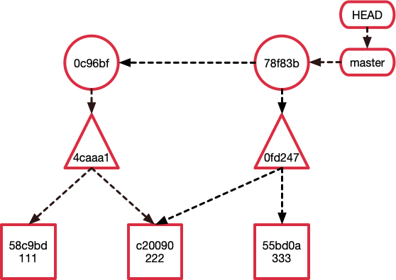

# git

- https://www.zhihu.com/collection/776971664
- https://marklodato.github.io/visual-git-guide/index-zh-cn.html
- https://git-scm.com/book/en/v2
- [这个PPT写的是真好!](https://www.lzane.com/slide/git-under-the-hood/#/)
- https://marklodato.github.io/visual-git-guide/index-zh-cn.html

## Git是怎么储存信息的

至此我们知道了Git是什么储存一个文件的内容、目录结构、commit信息和分支的。
**其本质上是一个key-value的数据库加上默克尔树形成的有向无环图（DAG）**。

- 圆: commit
- 三角: tree
- 方块: blob
- 长条: (refs)

## Git是怎么储存信息的

接下来我们来看一下Git的三个分区（工作目录、Index 索引区域、Git仓库），以及Git变更记录是怎么形成的。
了解这三个分区和Git链的内部原理之后可以对Git的众多指令有一个“可视化”的理解，不会再经常搞混。

- 工作目录 （ working directory ）：操作系统上的文件，所有代码开发编辑都在这上面完成。
- 暂存区（ index or staging area ）：可以理解为一个暂存区域，这里面的代码会在下一次commit被提交到Git仓库。
- Git仓库（ git repository ）：由Git object记录着每一次提交的快照，以及链式结构记录的提交变更历史。

