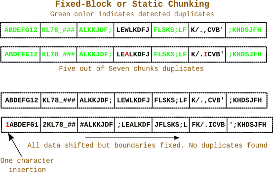

# CDC

- [High Performance Content Defined Chunking](https://moinakg.wordpress.com/2013/06/22/high-performance-content-defined-chunking/)

> 简述分块

Data Deduplication requires splitting a data stream into chunks and then searching for duplicate chunks.  Once duplicates are found only one copy of the duplicate is stored and the remaining chunks are references to that copy.  The splitting of data into chunks appears to be an ordinary process but is crucial to finding duplicates effectively.  The simplest is of course splitting data into fixed size blocks.  It is screaming fast, requiring virtually no processing.  It however comes with the limitation of the data shifting problem.

> 详述固定分块的缺点

The diagram below illustrates the problem. The two 64-character patterns are mostly similar with only two characters differing. Initially fixed-block chunking provides good duplicate detection. However the insertion of a single character at the beginning shifts the entire data while chunk boundaries are fixed. So no duplicates are found even though the patterns are mostly similar.

The chunks are split based on patterns in data so they are of variable length (but average size is close to the desired length). Since the chunk boundaries shift along with the data patterns, duplicates are still found. Only the modified chunks are unique.

> 为了改进固定分块缺陷，应该基于 pattern 分块.

### The Rolling Hash computation

Now the question comes as to what data patterns to look out for when determining the chunk boundaries or cut points? The common technique is to compute a hash value of a few consecutive bytes at every byte position in the data stream. If the hash value matches a certain predefined pattern we can declare a chunk boundary at that position. 

To do this computation efficiently a technique called the rolling hash was devised. It uses a sliding window that scans over the data bytes and provides a hash value at each point. The hash value at position I can be cheaply computed from the hash at position I-1. In other words H(X_{(i,n)}) \Leftarrow (H(X_{(i-1,n)}) + X_i - X_{(i-n)}) \bmod M where ‘n’ is the window size and X_{(i,n)} represents the window bytes at byte position ‘i’. In mathematical terms this is a recurrence relation. Rolling hashes have been used in contexts like Rabin-Karp substring search and Rsync. Today they are used extensively in chunk splitting in the context of data deduplication.

> - 但，如何根据 pattern 确定边界呢? 通常的方法是: 在数据流种，计算所有位置、一段连续字符的hash值, 取匹配某个预先定义的 pattern, 可以确定chunk边界.

To do this computation efficiently a technique called the **rolling hash** was devised. It uses a sliding window that scans over the data bytes and provides a hash value at each point. The hash value at position `I` can be cheaply computed from the hash at position `I-1`. In other words 

$$ 
H(X_{(i,n)}) \Leftarrow (H(X_{(i-1,n)}) + X_i - X_{(i-n)}) \bmod M
$$

where `‘n’` is the window size and $X_{(i,n)}$ represents the window bytes at byte position `‘i’`. In mathematical terms this is a *recurrence relation* .
Rolling hashes have been used in contexts like **Rabin-Karp** substring search and `Rsync`. 
Today they are used extensively in chunk splitting in the context of data deduplication.

> 介绍 KR rolling-hash function

One of the common rolling hashes used in Data Deduplication is **Rabin Fingerprinting** devised originally by *Turing award* winner *Michael O. Rabin* in his seminal paper titled 
`“Fingerprinting By Random Polynomials“` . The mathematically inclined will enjoy reading it. 
There are other rolling hash techniques such as the one used in `Rsync`, the `TTTD` algorithm devised by HP, the `FBC` algorithm etc.

> 列举各种各样的 rolling-hash function

While I am not so much of a mathematically inclined person I still needed a good rolling hash in order to do content defined chunking in Pcompress. After looking at various implementations like the one in `LBFS` and few other open-source software like `n-gram hashing`, I came up with an approach that worked well and produced average chunk sizes close to the desired value.

> 下面, 作者要描述自己找到的野路子, here we go

I used a small sliding window of 16 bytes that produces a 64-bit fingerprint at each byte position requiring an addition, subtraction, multiplication and conditionally an XOR for each byte position. 
It would declare a chunk boundary if the bottom `Y` bits of the fingerprint were zero. 
The value of `Y` would depend on the average chunk size desired. For example for 4KB average size 
one would look for bottom `12` bits to be zero. The core of the approach is derived from 
`Rabin Fingerprinting`. A good description is here: http://www.infoarena.ro/blog/rolling-hash. The hashing approach is a multiplicative scheme of the form:

$$
rollhash = (rollhash * PRIME + inbyte - outbyte * POW) \% MODULUS
$$

Where `inbyte` is Incoming byte into sliding window head, 
`outbyte` is outgoing byte from sliding window tail and $POW = (PRIME ^ {windowsize}) \% MODULUS$ . The `PRIME` number I am using is the same value used by Bulat Ziganishin in his **SREP** tool. Experimentation showed it to produce good results. In addition to this I precompute a table using the irreducible polynomial (represented in **GF(2)**) from LBFS. The `outbyte` is used to index the table and the value is XOR-ed with the hash value to produce the final fingerprint. I did some analysis of the chunking approach which is documented in two earlier posts. The results were good.

- Inside Content-Defined Chunking in Pcompress, part – 1 (测试数据)
- Inside Content-Defined Chunking in Pcompress, part – 2

> 上面一段，解释了 dolt 的 CDC 的来源

A window size of only 16 bytes will raise some eyebrows as typically much larger windows are used. LBFS for example used a 48-byte window and others have used even larger windows. However in practice, as is evident from the above analysis, this implementation does produce good results and the window size of 16 bytes allows an optimization as we will see below.

> 特定情况的优化

## Optimizations

## Worst Case performance profile

缺陷

