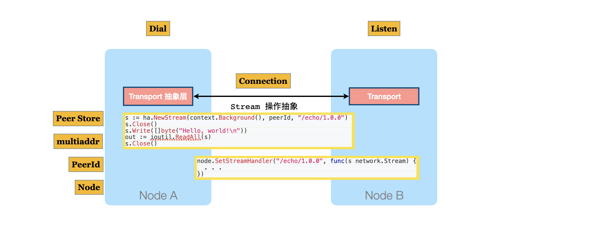
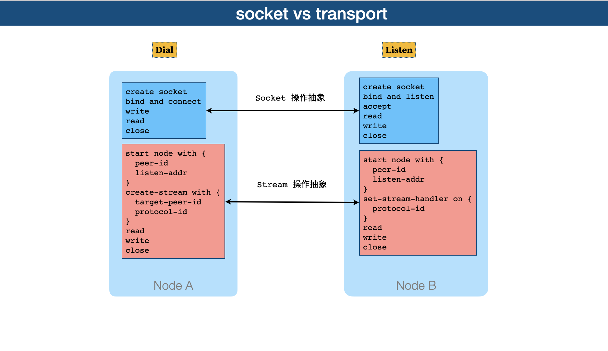

# libp2p 入门

参考

- https://docs.libp2p.io/concepts/
- libp2p > Concepts 

## echo v1: 简单例子

涉及到的[术语](https://docs.libp2p.io/reference/glossary/)
- **Node** : node 的含义太过于宽泛. 在这里，一般指 p2p 中的一个节点实例
- **Peer** : 指 p2p 中的一个参与者， 经常用 node 代替
- **Transport** : 网络的抽象层，类比于 TCP/UDP 层, (libp2p 在 transport 之上，抽象出编程模型, 类比于 socket)
  - **Listen** : 类似 tcp server
  - **Dial** : 类似 tcp client
  - **Connection** : 类似 tcp connection
  - **multiaddr** : 类似 inet addr
  - 以上都属于 transport 范畴
- **PeerId** : A ***unique***, ***verifiable*** identifier for a peer, 且无法被伪造。
  (当然要借助DHT的帮助). 
  PeerId 独立于 transport, 好处是: 不管transport的底层采用什么网络通信，不影响peerid的校验。
  且不会因为ip的变化而变化！
- **Peer store** : A data structure that stores PeerIds for known peers, along with known multiaddresses that can be used to communicate with them.
- **Protocol Id** :

### 代码解释 

- https://github.com/libp2p/go-libp2p/tree/master/examples/echo



1. 创建Node
  ```go
  h, err := libp2p.New(
    // transport 启动 tcp 监听, (实际上 Dial 端可以不设置)
    libp2p.ListenAddrStrings(fmt.Sprintf("/ip4/127.0.0.1/tcp/%d", listenPort)),
    // PeerId 随机产生
    libp2p.Identity(priv),
    // 暂时没有 DHT, 故无法处理安全
    libp2p.NoSecurity,
  )
  ```
2. Listen 端
  ```go
  ha.SetStreamHandler("/echo/1.0.0", func(s network.Stream) {
    log.Println("listener received new stream")
    if err := doEcho(s); err != nil {
      log.Println(err)
      s.Reset()
    } else {
      s.Close()
    }
  })
  // doEcho reads a line of data a stream and writes it back
  func doEcho(s network.Stream) error {
    buf := bufio.NewReader(s)
    str, err := buf.ReadString('\n')
    if err != nil {
      return err
    }

    log.Printf("read: %s", str)
    _, err = s.Write([]byte(str))
    return err
  }
  ```
  其中
    - `/echo/1.0.0` 是自定义的 **Protocol Id**
3. Dail 端
  - 首先，输入参数 targetPeer = 
    `/ip4/127.0.0.1/tcp/61319/p2p/QmabhgJ6kbZaUCcYAfe4ryqEDBrmFfrK7BV9vSPvoZRkCB`
  - 解析出 targetPeerId = `QmabhgJ6kbZaUCcYAfe4ryqEDBrmFfrK7BV9vSPvoZRkCB` 
    targetAddr = `/ip4/127.0.0.1/tcp/61319`
  - 将 target(peerId, addr) 条目插入到 Peerstore, 让 libp2p 知道对方的位置. 
    - *目前没有 DHT 协调，需要人工插入，带后续再看看自动模式*
  - 然后直接开始 Stream 操作
    ```go
    s, err := ha.NewStream(context.Background(), peerid, "/echo/1.0.0")
    defer s.Close()
    _, err = s.Write([]byte("Hello, world!\n"))
    out, err := ioutil.ReadAll(s)
    log.Printf("read reply: %q\n", out)
    ```

### 小结

到目前为止，用到的 multiaddr 结构
```
peer peer-addr
--------------------------------------------------------------------------
                       peer p2p-addr
                       ---------------------------------------------------
/ip4/127.0.0.1/tcp/2000/p2p/QmabhgJ6kbZaUCcYAfe4ryqEDBrmFfrK7BV9vSPvoZRkCB
-----------------------     ----------------------------------------------
peer listen-addr            peer id
```

编程模型


## echo v2: Nat穿透

